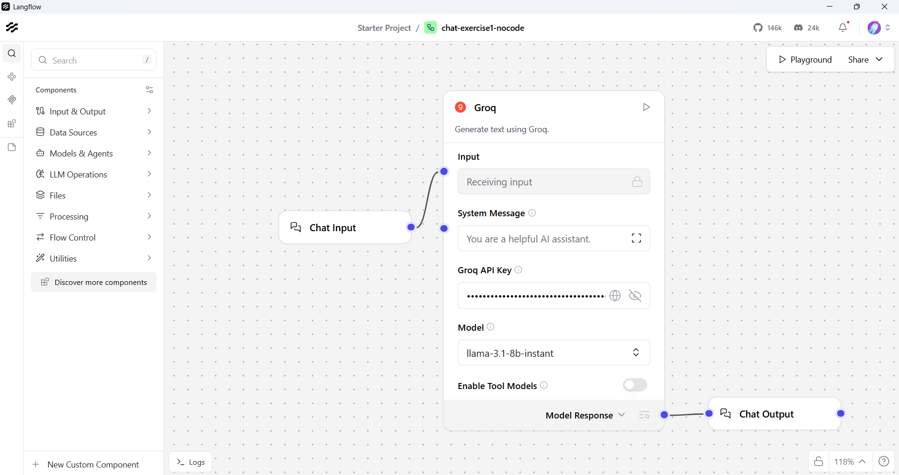
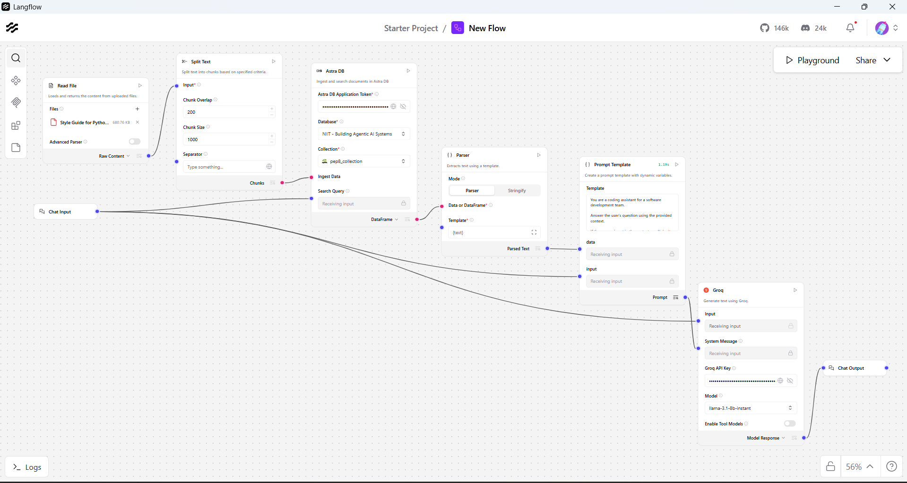

# Langflow AI Chatbots — Basic & Knowledge-Based (RAG)

---

## Overview

This project contains two AI chatbot exercises built using **Langflow**, a no-code/low-code visual workflow builder for AI applications. Both chatbots are powered by **Groq LLM** (using the `llama-3.1-8b-instant` model) and demonstrate progressively advanced capabilities — from a simple conversational chatbot to a document-aware assistant that answers questions based on a specific knowledge source.

The project is designed to introduce the fundamentals of building LLM-powered pipelines visually, without writing complex backend code.

---

## Objectives

- Understand how to build and run AI workflows using Langflow.
- Integrate Groq LLM into a no-code pipeline.
- Implement Retrieval-Augmented Generation (RAG) using a PDF document as a knowledge base.
- Use Astra DB as a vector database for storing and retrieving document chunks.
- Learn how each component in a workflow (file reader, text splitter, vector store, prompt template, LLM) fits together.

---

## Technologies Used

| Technology | Purpose |
|---|---|
| [Langflow](https://www.langflow.org/) | Visual AI workflow builder |
| [Groq](https://groq.com/) | LLM provider (`llama-3.1-8b-instant`) |
| [Astra DB](https://www.datastax.com/products/datastax-astra) | Vector database for RAG (storage + retrieval) |
| Python / pip | Environment setup and Langflow installation |
| PEP 8 PDF | Knowledge source document for Exercise 2 |

---

## Exercise 1: Basic Chatbot

### Description

A straightforward conversational chatbot built entirely within Langflow. The user types a message, and the Groq LLM generates a relevant response. There is no external knowledge source — the model relies solely on its pre-trained knowledge.

### Workflow Components

```
Chat Input → Groq LLM (llama-3.1-8b-instant) → Chat Output
```

- **Chat Input** — Accepts the user's message from the Langflow playground.
- **Groq LLM** — Processes the input and generates a response using the `llama-3.1-8b-instant` model.
- **Chat Output** — Displays the model's response back to the user.

### Key Points

- No external documents or databases are involved.
- Demonstrates the most minimal viable LLM pipeline in Langflow.
- Useful for general-purpose Q&A, brainstorming, or conversational tasks.

### Screenshots — Exercise 1

> **Langflow Workflow Canvas**
>
> 


---

## Exercise 2: Knowledge-Based Chatbot (RAG)

### Description

A more advanced chatbot that uses **Retrieval-Augmented Generation (RAG)** to answer questions based on a specific uploaded document — the **PEP 8 Python Style Guide** (PDF). Instead of relying solely on the LLM's general knowledge, the system first retrieves the most relevant sections from the document and then uses them to generate a grounded, accurate answer.

### What is RAG?

RAG (Retrieval-Augmented Generation) is a technique that enhances LLM responses by supplying relevant context from an external knowledge source at query time. The process works in two phases:

1. **Indexing phase** — The document is read, split into smaller chunks, stored in Astra DB, which internally generates embeddings using the configured model.
2. **Retrieval phase** — When the user asks a question, the system searches the vector database for the most semantically similar chunks and passes them as context to the LLM alongside the user's query.

This approach reduces hallucination and ensures answers are grounded in the provided document.

### Workflow Components

```
Read File → Split Text → Astra DB (store)
                                  ↓
Chat Input → Astra DB (retrieve) → Parser → Prompt Template → Groq LLM → Chat Output
```

### Component Breakdown

| Component | Role |
|---|---|
| **Read File** | Loads the PEP 8 PDF from the local file system into the workflow. |
| **Split Text** | Breaks the document into smaller overlapping chunks so each piece fits within the LLM's context window and can be searched efficiently. |
| **Astra DB (store)** | Stores each text chunk in Astra DB, which internally handles embedding generation using the configured NVIDIA embedding model. |
| **Chat Input** | Accepts the user's question from the Langflow playground. |
| **Astra DB (retrieve)** | Performs a semantic similarity search using the user's query and returns the most relevant chunks from the database. |
| **Parser** | Converts the structured output from Astra DB (which comes as a list of document objects) into clean, plain text that the Prompt Template can use. |
| **Prompt Template** | Combines the retrieved context and the user's question into a single structured prompt using two variables: `{data}` (the retrieved document chunks) and `{input}` (the user's original question). |
| **Groq LLM** | Receives the populated prompt and generates an answer grounded in the retrieved context. |
| **Chat Output** | Returns the final answer to the user. |

### Why Each Component Matters

**Split Text (Chunking)**
Large documents cannot be processed as a single block — they exceed token limits and make retrieval imprecise. Splitting the text into smaller, overlapping chunks ensures that each chunk is semantically focused and that relevant passages can be found accurately during search.

**Astra DB**
Astra DB serves a dual purpose: it acts as a **vector store** during indexing (saving embeddings) and as a **retrieval engine** during querying (finding the most relevant chunks via similarity search). It is a managed, serverless database requiring no local setup.

**Parser**
The Astra DB retrieval step returns structured Python objects (document metadata + text). The Parser component flattens these into clean, readable plain text so the Prompt Template can insert them directly into the prompt without formatting errors. The parser uses a simple template `{text}` to extract only the relevant text content from each retrieved document chunk.

**Prompt Template Variables**
- `{data}` — Holds the text chunks retrieved from Astra DB that are relevant to the user's question.
- `{input}` — Holds the user's original question passed in from Chat Input.

These variables must match the input connections in Langflow:
- `{data}` receives input from the Parser
- `{input}` receives input from Chat Input

A sample prompt template might look like:

```
You are a helpful assistant. Use the following context to answer the question.

Context:
{data}

Question:
{input}

Answer:
```

### Screenshots — Exercise 2

> **Langflow Workflow Canvas**
>
> 

---

## Architecture / Workflow Explanation

### Exercise 1 — Simple Pipeline

```
[User] → [Chat Input] → [Groq LLM] → [Chat Output] → [User]
```

The user's message flows directly to the LLM and the response is returned. No memory, no external data.

### Exercise 2 — RAG Pipeline

```
                  ┌──────────────────────────────────────┐
                  │           INDEXING PHASE             │
                  │  PDF → Read File → Split Text →      │
                  │  Astra DB (store embeddings)         │
                  └──────────────────────────────────────┘

                  ┌──────────────────────────────────────┐
                  │           RETRIEVAL PHASE            │
                  │  Chat Input → Astra DB (retrieve)    │
                  │  → Parser → Prompt Template          │
                  │  → Groq LLM → Chat Output            │
                  └──────────────────────────────────────┘
```

The indexing phase runs once to populate the database. The retrieval phase runs on every user query.

---

## Setup Instructions

### Prerequisites

- Python 3.10 or higher
- A [Groq](https://console.groq.com/) account and API key
- A [DataStax Astra DB](https://astra.datastax.com/) account

---

### Step 1 — Install Langflow

```bash
pip install langflow
```

### Step 2 — Run Langflow

```bash
python -m langflow run
```

Langflow will start and be accessible at `http://localhost:7860` in your browser.

---

### Step 3 — Set Up Astra DB

1. Go to [https://astra.datastax.com](https://astra.datastax.com) and create a free account.
2. Click **Create Database** and choose **Serverless (Vector)**.
3. Give your database a name (e.g., `langflow-rag`), select a cloud provider and region, and click **Create**.
4. Wait for the database status to show **Active**.

### Step 4 — Generate an Astra DB Application Token

1. Inside your Astra DB dashboard, navigate to your database.
2. Go to **Settings → Application Tokens**.
3. Click **Generate Token** and select the role **Database Administrator**.
4. Copy and save the **Token** value — you will need it in Langflow.

---

### Step 5 — Add Your Groq API Key

1. Go to [https://console.groq.com/keys](https://console.groq.com/keys) and generate an API key.
2. In Langflow, open the Groq component in your workflow.
3. Paste your Groq API key into the **API Key** field.

---

### Step 6 — Import the Flow into Langflow

1. Open Langflow at `http://localhost:7860`.
2. Click **New Flow → Import** (or use the upload button).
3. Select the provided `.json` flow file for the exercise you want to run.
4. The workflow will appear on the canvas, ready to configure.

---

### Step 7 — Configure Astra DB in the Workflow (Exercise 2 only)

In the Astra DB components on the canvas:

- Paste your **Application Token**
- Enter your **API Endpoint** (found in your Astra DB dashboard)
- Set the **Collection Name** (e.g., `pep8_collection`)

---

### Step 8 — Upload the PDF and Run Indexing (Exercise 2 only)

1. Connect the **Read File** component to your PEP 8 PDF file.
2. Run the ingestion portion of the flow to split and store the document in Astra DB.
3. Once indexing is complete, the chatbot is ready to answer questions.

---

## How It Works

### Exercise 1

1. The user types a question in the Langflow playground.
2. The **Chat Input** component passes the message to the **Groq LLM**.
3. Groq processes the prompt and returns a response.
4. The **Chat Output** component displays the answer.

### Exercise 2

1. The PEP 8 PDF is read and split into smaller text chunks.
2. Chunks are stored in Astra DB (embedding generation handled internally).
3. The user asks a question in the Langflow playground.
4. Astra DB performs a semantic search and retrieves the most relevant chunks.
5. The **Parser** converts the structured output from Astra DB into clean plain text.
6. The **Prompt Template** combines `{data}` (retrieved context) and `{input}` (user's question) into a single prompt.
7. The **Groq LLM** generates a context-aware answer from the assembled prompt.
8. The answer is displayed via **Chat Output**.

---

## Example Queries

Use these queries in the Exercise 2 chatbot to test the RAG pipeline:

| Query | Expected Behavior |
|---|---|
| `What is PEP 8?` | Returns an explanation of PEP 8 as Python's official style guide. |
| `How should variables be named in Python?` | Returns PEP 8 naming conventions for variables (snake_case). |
| `What is the indentation rule in Python?` | Returns the 4-space indentation rule from PEP 8. |
| `How long should a line of code be?` | Returns the 79-character maximum line length recommendation. |
| `When should I use blank lines in Python?` | Returns PEP 8 rules on separating functions and classes with blank lines. |

---

## Submission Contents

This submission includes the following files:

- **Langflow flow files** — Each exercise exported as a `.json` file, importable directly into Langflow.
- **Screenshots** — Screenshots of the workflow canvas and chat output for both exercises.
- **README.md** — This documentation file.

---

## Conclusion

This project demonstrates how to build AI chatbots of increasing complexity using Langflow and Groq — from a zero-setup basic chatbot to a fully functional RAG pipeline grounded in a real document. The no-code workflow approach makes it accessible to beginners while still covering core concepts like vector databases, semantic search, text chunking, and prompt engineering. These exercises serve as a practical foundation for building more advanced, domain-specific AI assistants.